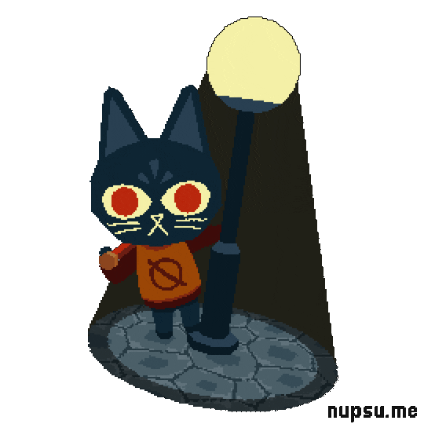

 

<!-- Typing Intro -->

 

<!-- Main Character -->

 

<!-- About Section -->
<pre>
💼 Student • OSS Contributor • Curious Learner
💻 JavaScript • React • Git
🔧 GitHub Actions • CI • Docs & Workflows
🌐 Open Source • Communities • Learning in Public
🎮 Music • Games • Anime • Code
</pre>

 

<!-- Activity Graph -->

<!-- GitHub Stats -->

  <tr>
    <td align="center">
      <h4 style="color:#8B0000; margin:0 0 15px 0;">
        Parv's Stats
      </h4>
      <table border="0" cellspacing="0" cellpadding="0">
        <tr>
          <td>
            
          </td>
          <td width="60"></td>
          <td>
            
          </td>
        </tr>
    </td>
  </tr>
</table>

<!-- Kyubey Accent -->
  

<!-- Profile Views Badge -->

