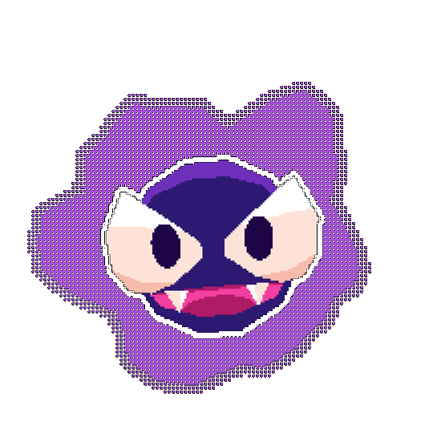

 
<pre>
💼 Student • OSS contributor • Curious learner
💻  JavaScript • React • Git
🔧 GitHub Actions • CI bots • Docs & workflows
🌐 Open source • Communities • Learning in public
🎮 Music • Games • Anime • Code 
</pre>

 

 

  

